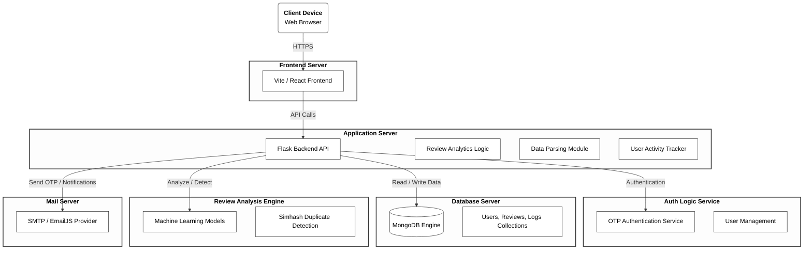

# Deployment Diagram

Below is the deployment diagram modeled after the reference workflow, adapted to use the actual components from the `FakeReview` project.

```mermaid
flowchart TD
    %% Node Definitions
    Client("<b>Client Device</b><br/>Web Browser")
    
    subgraph FrontendServer ["<b>Frontend Server</b>"]
        ReactUI["Vite / React Frontend"]
    end

    subgraph Auth_Server ["<b>Auth Logic Service</b>"]
        OTPAuth["OTP Authentication Service"]
        UserManager["User Management"]
    end

    subgraph AppServer ["<b>Application Server</b>"]
        direction TB
        FlaskAPI["Flask Backend API"]
        ReviewAnalyzer["Review Analytics Logic"]
        DataParser["Data Parsing Module"]
        ActivityTracker["User Activity Tracker"]
    end


    subgraph Database_Server ["<b>Database Server</b>"]
        MongoEngine[("MongoDB Engine")]
        Collections["Users, Reviews, Logs Collections"]
    end

    subgraph ML_Engine ["<b>Review Analysis Engine</b>"]
        MLAnalyzer["Machine Learning Models"]
        Simhash["Simhash Duplicate Detection"]
    end

    subgraph Mail_Server ["<b>Mail Server</b>"]
        SMTP["SMTP / EmailJS Provider"]
    end

    %% Connections
    Client -- "HTTPS" --> ReactUI
    ReactUI -- "API Calls" --> FlaskAPI
    
    FlaskAPI -- "Authentication" --> OTPAuth
    FlaskAPI -- "Read / Write Data" --> MongoEngine
    FlaskAPI -- "Analyze / Detect" --> MLAnalyzer
    FlaskAPI -- "Send OTP / Notifications" --> SMTP

    %% Apply basic styles to the nodes
    classDef default fill:#fff,stroke:#333,stroke-width:1px,color:#000;
    
    %% To make subgraphs outline prominently
    style FrontendServer fill:#fdfdfd,stroke:#333,stroke-width:2px,color:#000
    style AppServer fill:#fdfdfd,stroke:#333,stroke-width:2px,color:#000
    style Auth_Server fill:#fdfdfd,stroke:#333,stroke-width:2px,color:#000
    style Database_Server fill:#fdfdfd,stroke:#333,stroke-width:2px,color:#000
    style ML_Engine fill:#fdfdfd,stroke:#333,stroke-width:2px,color:#000
    style Mail_Server fill:#fdfdfd,stroke:#333,stroke-width:2px,color:#000
```
